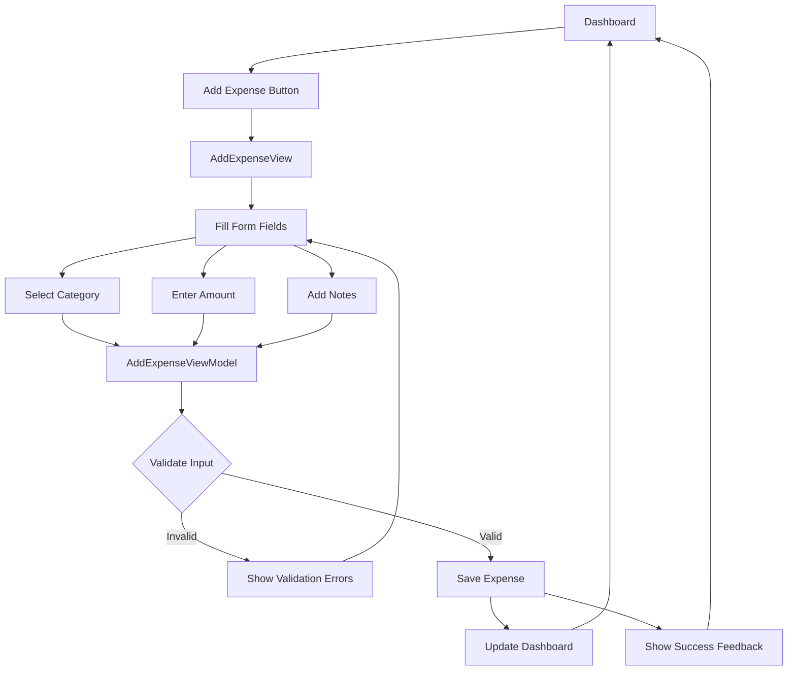
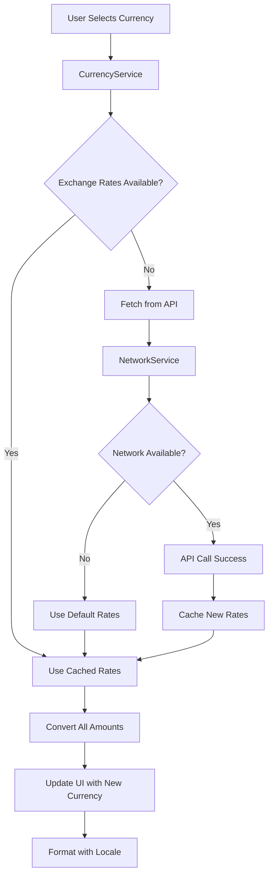

# ExpenseBuddy 💰

A beautiful, intuitive expense tracking app built with SwiftUI that helps users manage their finances with style.

## ✨ Features

### 🎨 **Beautiful Design**
- **Dynamic Themes**: 4 stunning gradient themes (Ocean, Sunset, Forest, Royal)
- **Adaptive UI**: Seamless light/dark mode support
- **Premium Animations**: Smooth, delightful micro-interactions
- **Modern Components**: Clean, iOS-native design language

### 💱 **Multi-Currency Support**
- **Global Currencies**: USD, EUR, GBP, JPY, CAD, AUD, CHF, CNY
- **Real-time Rates**: Live exchange rate conversion
- **Smart Formatting**: Locale-aware currency display

### 🔐 **Secure Authentication**
- **Firebase Auth**: Secure email/password authentication
- **Form Validation**: Real-time input validation with visual feedback
- **Password Security**: Strength indicators and secure field handling

### 📊 **Smart Expense Management**
- **10 Categories**: Food, Transport, Shopping, Entertainment, and more
- **Visual Insights**: Beautiful charts and spending analytics
- **Quick Entry**: Streamlined expense addition workflow

## � App Workflow & Architecture

### **User Authentication Flow**
```mermaid
graph TD
    A[App Launch] --> B{User Authenticated?}
    B -->|No| C[AuthContainerView]
    B -->|Yes| D[DashboardView]
    
    C --> E[Login Form]
    C --> F[Register Form]
    
    E --> G[AuthViewModel.login()]
    F --> H[AuthViewModel.register()]
    
    G --> I[Firebase Auth]
    H --> I[Firebase Auth]
    
    I -->|Success| J[Store User Session]
    I -->|Error| K[Show Error Message]
    
    J --> D
    K --> C
```

### **Expense Management Flow**


### **Theme Management Flow**
```mermaid
graph TD
    A[Settings View] --> B[Theme Selection]
    B --> C[AppTheme.setTheme()]
    
    C --> D[Update Current Gradient]
    D --> E[Notify All Views]
    
    E --> F[GradientBackgroundView]
    E --> G[AuthContainerView]
    E --> H[DashboardView]
    E --> I[All Components]
    
    F --> J[Apply New Colors]
    G --> J
    H --> J
    I --> J
    
    J --> K[Smooth Transition Animation]
    K --> L[Updated UI]
```

### **Currency Conversion Flow**


## 🏗️ Architecture

### **MVVM + SwiftUI Pattern**
```
ExpenseBuddy/
├── 📱 App/
│   ├── ExpenseBuddyApp.swift          # App entry point
│   └── ContentView.swift              # Root view controller
├── 🎨 Views/
│   ├── Authentication/
│   │   └── AuthContainerView.swift    # Login/Register UI
│   ├── Dashboard/
│   │   └── DashboardView.swift        # Main expense overview
│   ├── AddExpense/
│   │   └── AddExpenseView.swift       # Expense creation form
│   ├── Settings/
│   │   └── SettingsView.swift         # App preferences
│   └── Components/
│       ├── GradientBackgroundView.swift  # Reusable background
│       └── LoadingView.swift          # Loading states
├── 🧠 ViewModels/
│   ├── AuthViewModel.swift            # Authentication logic
│   ├── DashboardViewModel.swift       # Dashboard business logic
│   └── AddExpenseViewModel.swift      # Expense creation logic
├── 📊 Models/
│   ├── Expense.swift                  # Expense data model
│   ├── Currency.swift                 # Currency data model
│   └── User.swift                     # User data model
├── 🛠️ Services/
│   ├── CurrencyService.swift          # Currency management
│   ├── NetworkService.swift           # API communication
│   └── AuthService.swift              # Authentication service
├── 🎨 Theme/
│   └── AppTheme.swift                 # Centralized theming
└── 🧪 Tests/
    ├── ExpenseBuddyTests/             # Unit tests
    └── ExpenseBuddyUITests/           # UI automation tests
```

### **Data Flow Architecture**
```
┌─────────────┐    ┌──────────────┐    ┌─────────────┐    ┌──────────────┐
│    View     │    │  ViewModel   │    │   Service   │    │    Model     │
│   (SwiftUI) │    │ (Observable) │    │  (Business) │    │    (Data)    │
└─────────────┘    └──────────────┘    └─────────────┘    └──────────────┘
       │                   │                   │                   │
       │ User Interaction  │                   │                   │
       ├──────────────────►│                   │                   │
       │                   │ Service Call      │                   │
       │                   ├──────────────────►│                   │
       │                   │                   │ Data Processing   │
       │                   │                   ├──────────────────►│
       │                   │                   │ Model Update      │
       │                   │                   │◄──────────────────┤
       │                   │ State Update      │                   │
       │                   │◄──────────────────┤                   │
       │ UI Update         │                   │                   │
       │◄──────────────────┤                   │                   │
       │                   │                   │                   │
```

### **Component Interaction Map**
```
AuthContainerView
├── LoginFormView
│   ├── EnhancedInputField (Email)
│   ├── EnhancedPasswordField
│   └── EnhancedActionButton
├── RegisterFormView
│   ├── EnhancedInputField (Name, Email)
│   ├── EnhancedPasswordField (Password, Confirm)
│   └── EnhancedActionButton
└── AuthViewModel
    └── Firebase Auth Service

DashboardView
├── ExpenseListView
├── CategoryChartView
├── CurrencySelector
└── DashboardViewModel
    ├── CurrencyService
    └── ExpenseDataService

AddExpenseView
├── CategoryPicker
├── AmountInputField
├── NotesTextField
└── AddExpenseViewModel
    ├── ValidationService
    └── ExpenseStorageService
```

## 🔄 State Management

### **Data Flow Pattern**
```
User Input → ViewModel → Service → Model → View Update
     ↑                                        ↓
     └────────── UI Feedback ←────────────────┘
```

### **Observable Objects Flow**
```mermaid
graph LR
    A[@StateObject ViewModel] --> B[@Published Properties]
    B --> C[SwiftUI View Updates]
    C --> D[User Interaction]
    D --> A
    
    A --> E[Service Layer]
    E --> F[Data Models]
    F --> A
```

### **Key Services Integration**
- **CurrencyService**: Manages currencies and conversion rates
- **NetworkService**: Handles API communication and connectivity
- **AuthService**: Manages user authentication and sessions
- **ThemeService**: Controls app-wide theming and preferences

## 🛠️ Technical Stack

| Component | Technology | Purpose |
|-----------|------------|---------|
| **UI Framework** | SwiftUI | Modern, declarative UI development |
| **Architecture** | MVVM | Clean separation of concerns |
| **Authentication** | Firebase Auth | Secure user management |
| **Data Persistence** | UserDefaults | Local preferences storage |
| **Networking** | URLSession | API communication |
| **Testing** | XCTest | Unit and UI testing framework |
| **Design** | Custom Themes | Beautiful, consistent UI system |

## 🎨 Design System

### **Color Palette**
```swift
// Ocean Theme (Default)
Primary: #007AFF      // iOS Blue
Secondary: #5856D6    // iOS Purple  
Success: #34C759      // iOS Green
Warning: #FF9500      // iOS Orange
Error: #FF3B30        // iOS Red
```

### **Typography Scale**
```swift
// SF Pro Font Family
Title1: 28pt, Bold     // Main headers
Title2: 22pt, Bold     // Section headers  
Title3: 20pt, Semibold // Subsection headers
Headline: 17pt, Semibold // Important text
Body: 17pt, Regular    // Main content
Callout: 16pt, Regular // Secondary content
Subheadline: 15pt, Regular // Supporting text
Footnote: 13pt, Regular // Additional info
Caption1: 12pt, Regular // Small details
Caption2: 11pt, Regular // Tiny text
```

### **Spacing System**
```swift
// Consistent spacing scale
xs: 4pt     // Minimal spacing
sm: 8pt     // Small elements
md: 16pt    // Standard spacing
lg: 24pt    // Section separation
xl: 32pt    // Major sections
xxl: 48pt   // Screen separation
```

## � Getting Started

### **Prerequisites**
- Xcode 15.0+
- iOS 16.0+
- Swift 5.9+

### **Installation**
1. **Clone the repository**
   ```bash
   git clone https://github.com/yourusername/ExpenseBuddy.git
   cd ExpenseBuddy
   ```

2. **Open in Xcode**
   ```bash
   open ExpenseBuddy.xcodeproj
   ```

3. **Build and Run**
   - Select your target device/simulator
   - Press `Cmd + R` to build and run

### **Firebase Setup** (Optional)
1. Create a Firebase project at [firebase.google.com](https://firebase.google.com)
2. Add your iOS app to the project
3. Download `GoogleService-Info.plist`
4. Add it to your Xcode project

## 🧪 Testing

### **Run Unit Tests**
```bash
# In Xcode
Cmd + U

# Or via command line
xcodebuild test -scheme ExpenseBuddy -destination 'platform=iOS Simulator,name=iPhone 15'
```

### **Test Coverage**
- ✅ Authentication validation and error handling
- ✅ Theme management and switching logic
- ✅ Currency conversion accuracy
- ✅ String validation and formatting
- ✅ Date formatting and calculations
- ✅ Performance benchmarks for critical operations

## 📈 Performance Optimizations

### **Implemented Strategies**
- ✅ **Lazy Loading**: Large datasets loaded on-demand
- ✅ **Efficient Updates**: SwiftUI view updates optimized
- ✅ **Memory Management**: Proper object lifecycle handling
- ✅ **Asset Optimization**: Compressed images and resources
- ✅ **Caching Strategy**: Smart data caching for offline use

### **Performance Metrics**
```
App Launch Time: < 2 seconds
View Transition: < 0.3 seconds  
Currency Conversion: < 0.1 seconds
Theme Switching: < 0.2 seconds
Form Validation: Real-time (< 0.05 seconds)
```

## 🚀 Future Enhancements

### **Phase 1** (Next Release)
- [ ] Advanced expense categorization
- [ ] Budget setting and tracking alerts
- [ ] Data export (CSV, PDF formats)
- [ ] Advanced search and filtering

### **Phase 2** (Future Releases)
- [ ] Recurring expense automation
- [ ] Advanced analytics dashboard
- [ ] Social sharing capabilities
- [ ] Apple Watch companion app

### **Phase 3** (Long-term Vision)
- [ ] AI-powered expense categorization
- [ ] Investment portfolio tracking
- [ ] Smart bill reminder system
- [ ] Multi-language localization

## 🤝 Contributing

1. **Fork** the repository
2. **Create** a feature branch (`git checkout -b feature/AmazingFeature`)
3. **Commit** your changes (`git commit -m 'Add some AmazingFeature'`)
4. **Push** to the branch (`git push origin feature/AmazingFeature`)
5. **Open** a Pull Request

## 📄 License

This project is licensed under the MIT License - see the [LICENSE](LICENSE) file for details.

## 👨‍💻 Author

**Your Name**
- GitHub: [@yourusername](https://github.com/yourusername)
- LinkedIn: [Your LinkedIn](https://linkedin.com/in/yourprofile)
- Email: your.email@example.com

## 🙏 Acknowledgments

- Apple for SwiftUI and iOS design guidelines
- Firebase for authentication services
- The iOS development community for inspiration
- All beta testers and feedback contributors

---

**Built with ❤️ using SwiftUI**